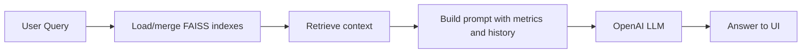

# Capstone Sales Analysis - Application Documentation

## 1. Purpose
Capstone Sales Analysis is a Streamlit application for sales intelligence using:
- CSV and PDF ingestion
- FAISS vector search
- RAG-based Q&A with OpenAI
- Metrics dashboards and evaluation workflows

Primary entry point: `app/main.py`.

---

## 2. Current UI Structure

### Sidebar Navigation
1. Home
2. Sales Metrics
3. Vector Store (with management and rebuild tabs)
4. Upload & Process
5. LLMOps

### Home Page
- Overview section with two-column onboarding table
- Chat area: **Chat with Your Data Analyst Bot**
- Database metrics tab (index counts, vector counts, storage visuals)

### LLMOps Tabs
1. Model Evaluation
2. Visualizations
3. AI Assistant
4. LangGraph Flow

---

## 3. Functional Components

### 3.1 Data Ingestion
- CSV files are read from `data/raw/`
- PDFs are read from `data/raw/PDF_Folder/`
- Upload and batch processing are managed from the `Upload & Process` page

### 3.2 Vector Database
- Vector indexes are managed in `vector_db/`
- Supports create, load, merge, backup, rename, and delete operations
- Dashboard and management are available in `Vector Store` page
- **New (Feb 2026):** Consolidated rebuild actions in `Vector Store` → **🔄 Rebuild Data** tab with two buttons:
  - **Rebuild Vector Store:** Rebuilds FAISS indexes from CSV files
  - **Build Aggregated Metrics:** Pre-computes KPI aggregations for chat context

### 3.3 Chat & Retrieval
- Chat interface loads available indexes and merges stores for retrieval
- Includes metrics context + chat history in prompt construction
- Uses `create_rag_chain()` from `src/llm.py`

### 3.4 Metrics Engine
- `src/summary_metrics.py` computes overall, temporal, product, regional, and customer metrics
- Visualizations are rendered using Plotly and Streamlit components

### 3.5 Evaluation
- LLMOps Model Evaluation uses `QAEvalChain` with compatibility resolver
- Evaluation flow now uses deterministic settings (`temperature=0`) and grade normalization

---

## 4. Module Map
- `app/main.py`: UI routing, page rendering, evaluation and assistant flows
- `src/database.py`: FAISS index lifecycle and similarity retrieval
- `src/loaders.py`: CSV/PDF loading and chunk preparation
- `src/llm.py`: LLM, embeddings, RAG chain templates
- `src/summary_metrics.py`: KPI computation and prompt metrics context
- `src/metrics_tool.py`: Aggregated metrics build/save utilities
- `env/config.py`, `env/secrets.py`: configuration and secret management

---

## 5. Runtime Flow (High Level)



---

## 6. Configuration Requirements
- Python 3.13+ (project currently uses venv)
- `.env` with `OPENAI_API_KEY`
- Dependencies from `requirements.txt`

Startup command:

```powershell
streamlit run app/main.py
```

---

## 7. Chat Accuracy & Metrics Integration

**Issue (Feb 21, 2026):** Chat was returning lower sales numbers than the Sales Metrics dashboard because it was retrieving individual transaction rows instead of aggregated totals.

**Solution:** Enhanced RAG chain to include aggregated metrics context:
- Metrics are pre-computed from CSV and cached in `data/processed/aggregated_metrics.pkl`
- Chat now always includes both individual document context AND aggregated summaries
- Vector store rebuilt to use current data (7 years of daily sales: 2022-2028)

**To maintain accuracy:** After updating CSV data, rebuild both components in `Vector Store` → **🔄 Rebuild Data**.

---

## 8. Known Behaviors
- If no vector indexes exist, chat and eval surfaces show guidance instead of failing
- If metrics source data is unavailable, metrics pages show error messaging and continue UI rendering
- Evaluation grade labels are normalized (e.g., CORRECT/INCORRECT/PARTIAL) before summary counts
- Chat responses now include aggregated KPI context for accurate sales totals and trends

---

## 9. Extension Points
- Add new document loaders in `src/loaders.py`
- Add additional scorecards in `src/summary_metrics.py`
- Add route-specific chains/prompts in `src/llm.py`
- Extend LLMOps with additional eval benchmarks and export formats
